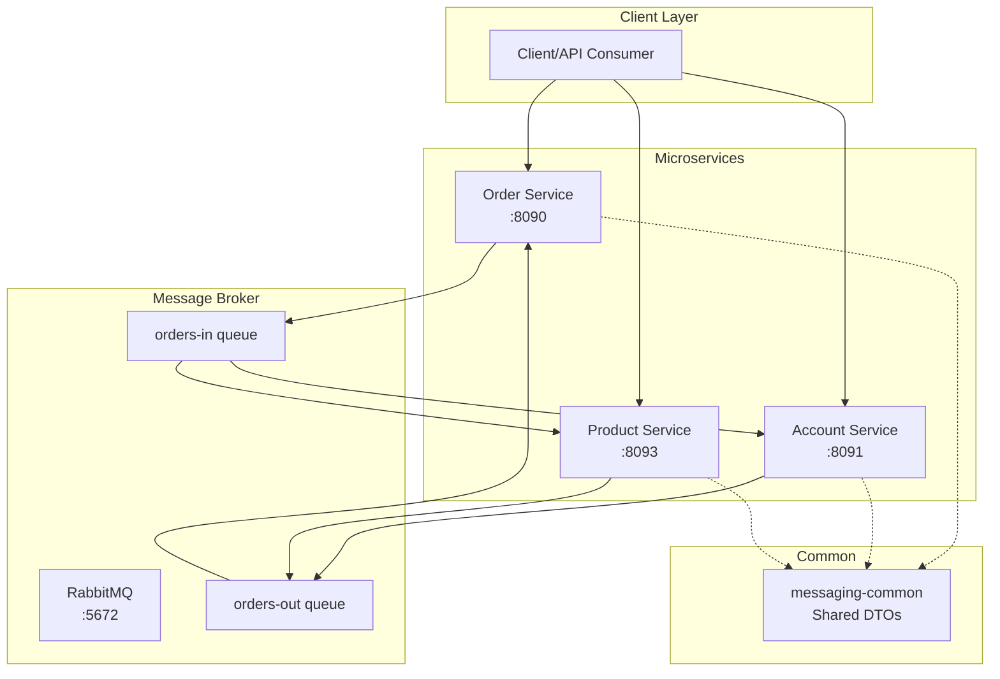

## Building and testing message-driven microservices using Spring Cloud Stream [](https://twitter.com/piotr_minkowski)

[](https://circleci.com/gh/piomin/sample-message-driven-microservices)

[](https://sonarcloud.io/dashboard?id=piomin_sample-message-driven-microservices)
[](https://sonarcloud.io/dashboard?id=piomin_sample-message-driven-microservices)
[](https://sonarcloud.io/dashboard?id=piomin_sample-message-driven-microservices)
[](https://sonarcloud.io/dashboard?id=piomin_sample-message-driven-microservices)

Detailed description can be found here: [Building and testing message-driven microservices using Spring Cloud Stream](https://piotrminkowski.com/2018/06/15/building-and-testing-message-driven-microservices-using-spring-cloud-stream/) 


## Table of Contents
- [Architecture Overview](#architecture-overview)
- [Technology Stack](#technology-stack)
- [Services Description](#services-description)
- [Message Flow](#message-flow)
- [Prerequisites](#prerequisites)
- [Running the Applications](#running-the-applications)
- [API Endpoints](#api-endpoints)
- [Testing](#testing)
- [Configuration](#configuration)
- [Monitoring and Management](#monitoring-and-management)

## Architecture Overview

This project demonstrates a message-driven microservices architecture using Spring Cloud Stream with RabbitMQ as the message broker. The system consists of three core business services that communicate asynchronously through message queues.



## Technology Stack

- **Java**: 21
- **Spring Boot**: 3.5.0
- **Spring Cloud**: 2025.0.0
- **Spring Cloud Stream**: Message-driven microservices framework
- **RabbitMQ**: Message broker for asynchronous communication
- **Maven**: Build and dependency management
- **Docker & Docker Compose**: Containerization and orchestration
- **Testcontainers**: Integration testing with real dependencies
- **CircleCI**: Continuous Integration
- **SonarCloud**: Code quality and security analysis
- **JaCoCo**: Code coverage analysis

## Services Description

### Order Service (port 8090)
The central orchestrator service that manages customer orders. It receives order requests via REST API and publishes order events.

**Key Features:**
- REST API for order management
- Order event publishing with customer-based partitioning
- Order status tracking and updates

### Account Service (port 8091)
Manages customer accounts and financial transactions. It listens for order events and processes withdrawals.

**Key Features:**
- Account management REST API
- Partitioned message consumption
- Account balance withdrawals

### Product Service (port 8093)
Handles product catalog and inventory. It processes order events to update availability.

**Key Features:**
- Product management REST API
- Partitioned message consumption
- Inventory tracking

### Messaging Common
Shared library with common DTOs and enums for consistent message contracts.

**Components:**
- `Order` – Order data model
- `OrderStatus` – Enumeration (NEW, PROCESSING, ACCEPTED, DONE, REJECTED)

## Message Flow

The services communicate through two main message destinations:

1. **orders-in**: Order Service publishes new orders
2. **orders-out**: Account and Product Services publish processing results

**Message Flow Pattern:**
```
1. Client creates order → Order Service
2. Order Service publishes order → orders-in queue
3. Account Service processes withdrawal → orders-out queue
4. Product Service updates inventory → orders-out queue
5. Order Service receives updates → Final order status
```

**Partitioning Strategy:**
- Partitioned by `customerId` for ordered processing
- Supports multiple instances per service with load balancing

## Prerequisites

- **Java 21** or higher
- **Maven 3.6+**
- **Docker & Docker Compose**
- **Git**

## Running the Applications

### 1. Clone the Repository
```bash
git clone https://github.com/piomin/sample-message-driven-microservices.git
cd sample-message-driven-microservices
```

### 2. Start RabbitMQ
```bash
docker-compose up -d
```
- RabbitMQ AMQP on 5672
- Management UI on http://localhost:15672 (guest/guest)

### 3. Build the Project
```bash
mvn clean compile
```

### 4. Start the Services
**Option A: Separate terminals**
```bash
cd order-service && mvn spring-boot:run
cd account-service && mvn spring-boot:run
cd product-service && mvn spring-boot:run
```
**Option B: Background**
```bash
cd order-service && mvn spring-boot:run &
cd account-service && mvn spring-boot:run &
cd product-service && mvn spring-boot:run &
```

### 5. Verify Health
```bash
curl http://localhost:8090/actuator/health
curl http://localhost:8091/actuator/health
curl http://localhost:8093/actuator/health
```

### Multiple Instances (Partitioned)
```bash
SPRING_PROFILES_ACTIVE=instance1 mvn spring-boot:run -pl account-service
SPRING_PROFILES_ACTIVE=instance2 mvn spring-boot:run -pl account-service

SPRING_PROFILES_ACTIVE=instance1 mvn spring-boot:run -pl product-service
SPRING_PROFILES_ACTIVE=instance2 mvn spring-boot:run -pl product-service
```

## API Endpoints

### Order Service (http://localhost:8090)
| Method | Endpoint                        | Description                |
|--------|---------------------------------|----------------------------|
| POST   | `/orders`                       | Create a new order         |
| PUT    | `/orders`                       | Update an order            |
| GET    | `/orders/{id}`                  | Get order by ID            |
| GET    | `/orders/customer/{customerId}` | Get orders by customer ID  |

### Account Service (http://localhost:8091)
| Method | Endpoint                                 | Description                   |
|--------|------------------------------------------|-------------------------------|
| POST   | `/accounts`                              | Create a new account          |
| PUT    | `/accounts`                              | Update an account             |
| PUT    | `/accounts/withdraw/{id}/{amount}`       | Withdraw amount from account  |
| GET    | `/accounts/{id}`                         | Get account by ID             |
| GET    | `/accounts/customer/{customerId}`        | Get accounts by customer ID   |

### Product Service (http://localhost:8093)
| Method | Endpoint             | Description             |
|--------|----------------------|-------------------------|
| POST   | `/products`          | Create a new product    |
| PUT    | `/products`          | Update a product        |
| GET    | `/products/{id}`     | Get product by ID       |
| GET    | `/products/ids`      | Get products by IDs     |

### Example API Usage
```bash
curl -X POST http://localhost:8091/accounts \
  -H "Content-Type: application/json" \
  -d '{"customerId":1,"balance":1000}'

curl -X POST http://localhost:8093/products \
  -H "Content-Type: application/json" \
  -d '{"name":"Sample","price":50,"count":100}'

curl -X POST http://localhost:8090/orders \
  -H "Content-Type: application/json" \
  -d '{"customerId":1,"productIds":[1],"price":50}'
```

## Testing

### Running Tests
```bash
mvn test
mvn test -pl order-service
mvn test -pl account-service
mvn test -pl product-service
```

### Test Structure
- `OrderControllerTest` – Order Service REST endpoints
- `OrderReceiverTest` – Account Service message handling
- `OrderReceiverTest` – Product Service message handling

### Code Coverage
```bash
mvn jacoco:report
```
Coverage reports in `target/site/jacoco/index.html` per module.

## Configuration

### Environment Variables
| Variable                 | Default            | Description                        |
|--------------------------|--------------------|------------------------------------|
| `PORT`                   | service-specific   | Override default service port      |
| `SPRING_PROFILES_ACTIVE` |                    | Activate specific Spring profiles  |

### RabbitMQ Configuration
- Host: localhost
- Port: 5672
- Username: guest
- Password: guest

### Service Discovery
Eureka available at http://localhost:8761/eureka/ (optional)

### Message Destinations
- **orders-in**: Direct exchange for new orders
- **orders-out**: Topic exchange for processing results
- **Partitioning**: 2 partitions by `customerId`

## Monitoring and Management

All services expose Actuator endpoints:
- Health: `/actuator/health`
- Metrics: `/actuator/metrics`
- Stream bindings: `/actuator/bindings`

**RabbitMQ Management UI:** http://localhost:15672 (guest/guest)
